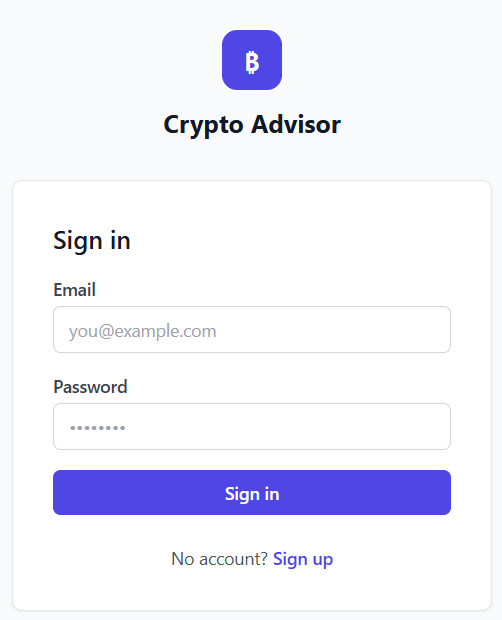
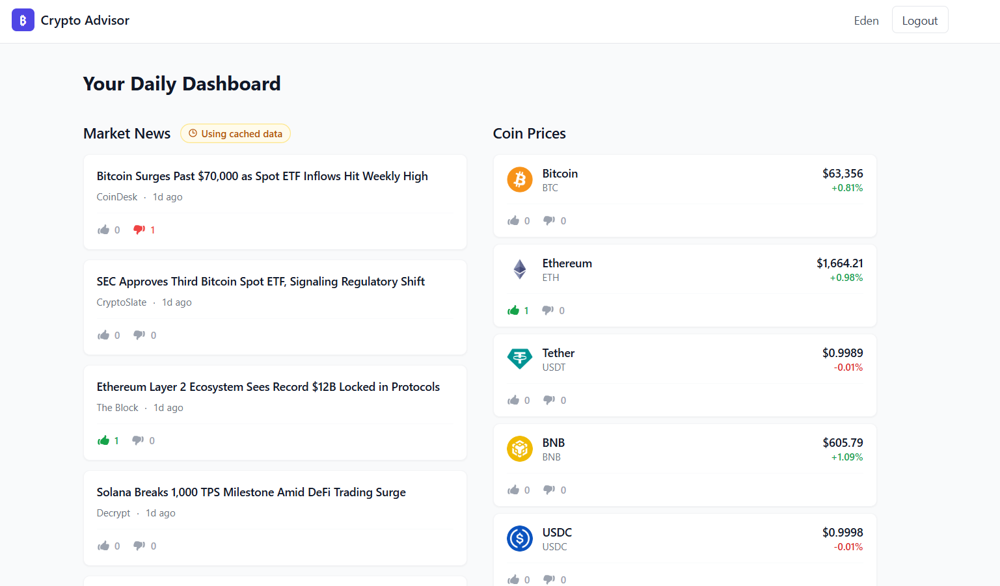

# AI Crypto Advisor Dashboard

A personalized full-stack crypto investor dashboard. Users register, complete a one-time onboarding, and receive a daily dashboard tailored to their preferences: preferred assets, investor type, and content interests.

## Live Demo

- Frontend: https://ai-crypto-advisor-seven.vercel.app
- Backend API: https://ai-crypto-advisor-9ti6.onrender.com

## Demo Account

Email: admin@gmail.com
Password: Admin1234


> Note: The backend is hosted on Render's free tier. The first request after inactivity may take up to 60 seconds while the service wakes up.

---

## Screenshots

| Login | Dashboard |
|-------|-----------|
|  |  |


---

## Features

- **Personalized Market News** — headlines reordered to surface the user's selected assets first
- **Live Coin Prices** — real-time prices from CoinGecko, preferred coins pinned at the top
- **AI Insight of the Day** — daily insight generated by an LLM, personalized by investor type and selected assets; cached per profile per day
- **Crypto Meme** — pulled from r/CryptoCurrency; changes on refresh
- **Content Voting** — thumbs-up / thumbs-down on every item; persisted and restored on reload
- **Graceful fallbacks** — all four sections work without any API keys; a badge indicates when static data is shown

---

## Local Setup

### Prerequisites

| Tool | Version |
|------|---------|
| Node.js | 20 LTS |
| npm | 9+ |

No database installation required — SQLite is embedded via `better-sqlite3`.

### 1. Clone

```bash
git clone https://github.com/edenzeira/ai-crypto-advisor.git
cd ai-crypto-advisor
```

### 2. Backend

```bash
cd backend
cp .env.example .env
# Open .env and set JWT_SECRET to any long random string.
# All other keys are optional — fallback data is used when absent.
npm install
npm run dev
# Server starts at http://localhost:3001
# SQLite database created at ./data/database.sqlite on first run
```

### 3. Frontend (new terminal)

```bash
cd frontend
cp .env.example .env
# Default: VITE_API_URL=http://localhost:3001 — no changes needed for local dev
npm install
npm run dev
# App starts at http://localhost:5173
```

Open **http://localhost:5173** in your browser.

### Environment Variables

#### `backend/.env`

| Variable | Required | Description |
|----------|----------|-------------|
| `JWT_SECRET` | Yes | Any long random string used to sign tokens |
| `PORT` | No | Defaults to `3001` |
| `DATABASE_PATH` | No | Defaults to `./data/database.sqlite` |
| `FRONTEND_URL` | No | Allowed CORS origin; defaults to `http://localhost:5173` |
| `CRYPTOPANIC_API_KEY` | No | [cryptopanic.com](https://cryptopanic.com/developers/api/) — fallback news used if absent |
| `OPENROUTER_API_KEY` | No | [openrouter.ai](https://openrouter.ai/) — fallback insight used if absent |
| `HUGGINGFACE_API_KEY` | No | Secondary AI provider; tried if OpenRouter fails |
| `NODE_ENV` | No | Set to `production` on Render |

#### `frontend/.env`

| Variable | Required | Description |
|----------|----------|-------------|
| `VITE_API_URL` | Yes (default provided) | Backend base URL (`http://localhost:3001` locally) |

---

## Architecture

```
ai-crypto-advisor/
├── frontend/          → React 19 + TypeScript + Vite + Tailwind CSS
│                        Deployed to Vercel
└── backend/           → Node.js + Express + TypeScript + SQLite
                         Deployed to Render
```

The two apps are independent deployable units; no code is shared between them.

### Tech Stack

#### Frontend
- React
- TypeScript
- Vite
- Tailwind CSS
- React Router
- Axios

#### Backend
- Node.js
- Express
- TypeScript
- SQLite
- JWT Authentication

#### External APIs
- CoinGecko
- CryptoPanic
- OpenRouter
- Reddit

### Frontend

- **React Router ** for client-side routing with auth and onboarding guards
- **AuthContext** stores the JWT in `localStorage` and exposes `login` / `logout`
- **DashboardPage** fetches all four sections in parallel on mount; each section is independently error-bounded
- **useVotes** hook manages vote state with optimistic UI updates; reverts via server refetch on API error
- 401 responses on protected routes automatically redirect to `/login?reason=expired`

### Backend

- **Express 4** with JWT auth middleware on all protected routes
- **SQLite** via `better-sqlite3` — four tables: `users`, `user_preferences`, `votes`, `daily_insights`
- **Service layer** per external API; each service returns `{ data, isFallback }` so routes never throw
- **AI insight cache** keyed by `date:investorType:sortedAssets` — different preference profiles get their own daily insight; no redundant LLM calls within the same profile on the same day

### Data flow — personalization

```
Login → load user_preferences
         ↓
/dashboard/news    → getNews(preferredAssets)     → sort live/fallback headlines by asset keywords
/dashboard/prices  → getCoinPrices(userId)        → preferred coins sorted to top
/dashboard/insight → getDailyInsight(prefs)       → LLM prompt includes investor type + assets;
                                                     cache key scoped to profile
/dashboard/meme    → getMeme()                    → random from Reddit (same for all users)
```

---

## API Routes

All protected routes require `Authorization: Bearer <token>`.

| Method | Path | Auth | Description |
|--------|------|------|-------------|
| `POST` | `/api/auth/register` | — | Create account; returns JWT + user |
| `POST` | `/api/auth/login` | — | Authenticate; returns JWT + user |
| `GET` | `/api/auth/me` | 🔒 | Return current user |
| `POST` | `/api/onboarding` | 🔒 | Save preferences, mark onboarding complete |
| `GET` | `/api/dashboard/news` | 🔒 | Market news (personalized order) |
| `GET` | `/api/dashboard/prices` | 🔒 | Coin prices (preferred coins first) |
| `GET` | `/api/dashboard/insight` | 🔒 | AI insight of the day (cached per profile) |
| `GET` | `/api/dashboard/meme` | 🔒 | Crypto meme |
| `GET` | `/api/votes` | 🔒 | User's votes + aggregate counts |
| `POST` | `/api/votes` | 🔒 | Cast or change a vote |
| `DELETE` | `/api/votes/:contentId/:contentType` | 🔒 | Remove a vote |
| `GET` | `/api/health` | — | Health check; used to wake Render from cold start |

Full request/response shapes: [`specs/001-ai-crypto-advisor/contracts/api.md`](specs/001-ai-crypto-advisor/contracts/api.md)

---

## Deployment

### Backend → Render

1. Create a new **Web Service** on [render.com](https://render.com); connect this GitHub repo
2. Set **Root Directory** to `backend`
3. **Build command**: `npm install && npm run build`
4. **Start command**: `node dist/index.js`
5. Add environment variables:

   | Key | Value |
   |-----|-------|
   | `JWT_SECRET` | A long random string (generate with `openssl rand -hex 32`) |
   | `FRONTEND_URL` | Your Vercel frontend URL (set after step below) |
   | `CRYPTOPANIC_API_KEY` | Optional |
   | `OPENROUTER_API_KEY` | Optional |
   | `NODE_ENV` | `production` |

6. Deploy and confirm `GET /api/health` returns `{"status":"ok"}`.

> **Render free tier** spins down after 15 minutes of inactivity. The first request after a cold start may take up to 60 seconds. The frontend shows loading spinners per section while waiting.

### Frontend → Vercel

1. Import this GitHub repo on [vercel.com](https://vercel.com)
2. Set **Root Directory** to `frontend`
3. Framework preset: **Vite**
4. Add environment variable:

   | Key | Value |
   |-----|-------|
   | `VITE_API_URL` | Your Render backend URL (e.g. `https://your-app.onrender.com`) |

5. Deploy. The `frontend/vercel.json` rewrite rule ensures direct URL access to any route returns the app (no 404 on refresh).

---

## Useful Commands

```bash
# Backend
npm run dev        # Start with hot reload (ts-node-dev)
npm run build      # Compile TypeScript → dist/
npm run start      # Run compiled dist/index.js

# Frontend
npm run dev        # Vite dev server
npm run build      # Production build → dist/
npm run preview    # Preview production build locally
npm run lint       # Run ESLint
```

---
